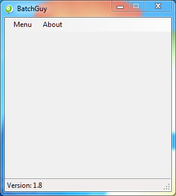
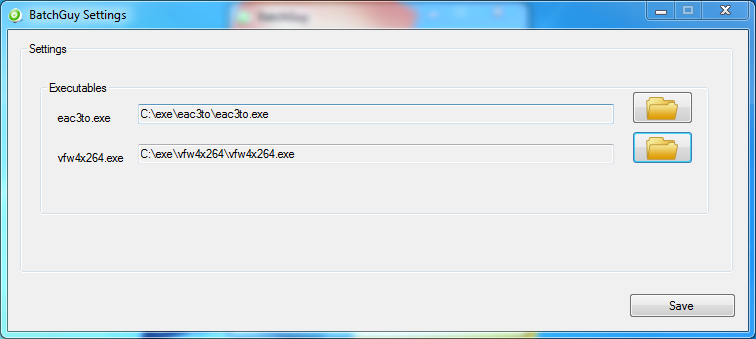
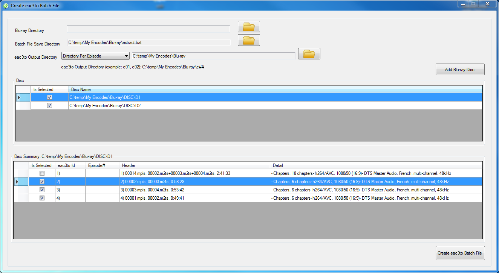
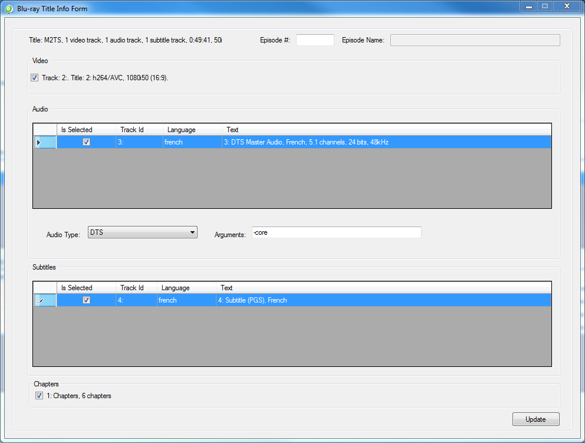
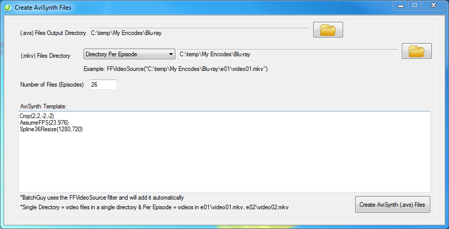
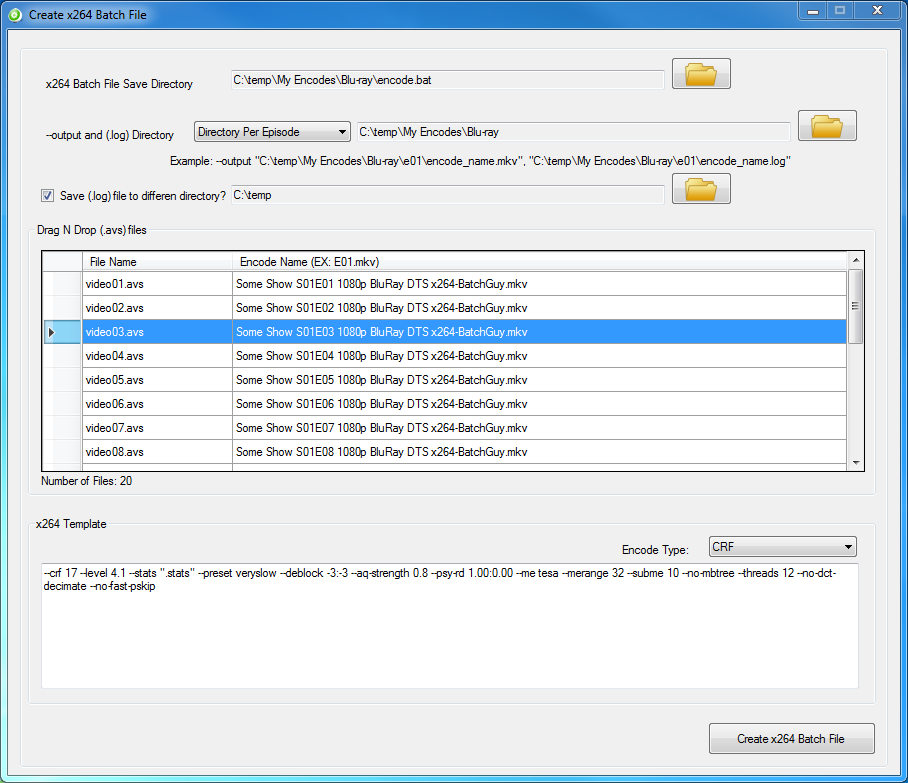
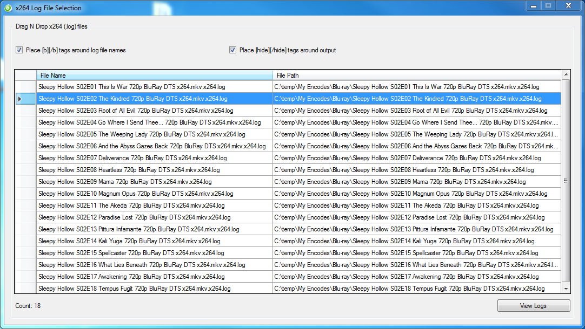
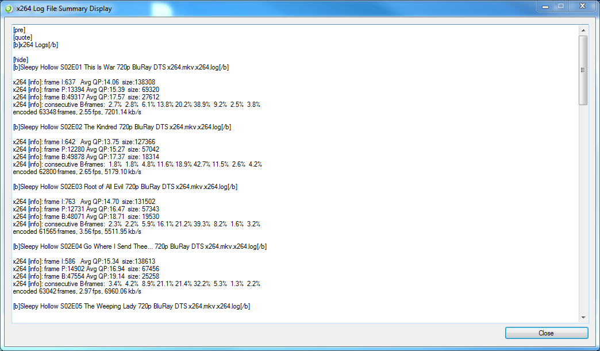

<h1>What is BatchGuy?</h1>
One of my hobbies is to collect full Blu-ray discs and to either remux or encode them.  I am a huge fan of TV Shows, so I typically work with multiple discs that contain tv series that can have over 30 episodes.

The problem that I faced is that most of the GUI tools available do not allow you to work with Blu-rays from a batch point of view.  This is fine for movies but having to manually work with each stream on each disc for each episode is very tiresome.  Because of this, I decided to make my own tool to ease some of the pain. 

As I continued to make modifications to BatchGuy, I started to think that this tool could possibly be helpful to other Blu-ray encoders such as myself, so I decided to share this tool with the community.

<h1>What BatchGuy isn’t?</h1>
BatchGuy was created to do a specific job, which is to allow the user to be able to easily extract streams from multiple ripped Blu-ray dics, place them in an individual episode number directory, create AviSynth scripts per episode and apply global x264 encode settings for each episode.  

BatchGuy is not an AviSynth editor.  It has very limited AviSynth syntax capabilities (which could be expanded as the product evolves).  It allows you to copy/paste AviSynth syntax into it and it will create a (.avs) file for each video you extracted from your Blu-ray discs.

BatchGuy is not an x264 encoder.  BatchGuy will create a (.bat) file that you can use to run the x264.exe encoder.  BatchGuy will not extract streams from Blu-ray discs for you.  BatchGuy will allow you to pick which streams you would like to extract and will create a (.bat) file that will use eac3to.exe to extract the streams.

<h1>Overview</h1>
BatchGuy, in a nutshell allows you to choose ripped Blu-ray dics on your hard drive, pick the chapters, video, audio and subtitles, specify what episode number they are and will create a batch file (.bat) that you can run to extract all the streams.  The streams will be placed in directory of your choosing.  If you chose to save the streams to a single directory, all the files will be extracted to one directoy.  If you chose to save to a directory per episode, the files will be extracted to the directory you chose plus the episode number you gave it ie e01, e02 etc etc.

After you have extracted all of your files, BatchGuy will allow you create AviSynth Script files (.avs) for all of your extracted video streams (.mkv).  You just tell BatchGuy where you would like to output the scripts, specify some limited AviSynth syntax for each video ie cropping, resizing etc etc and how many video streams (.mkv) you have.  BatchGuy will then create an AviSynth Script file for each video stream ie encode01.avs, encode02.avs etc etc and each script file will have the same AviSynth syntax.  BatchGuy is limited to FFVideoSource and the video stream (.mkv) location for FFVideoSource will be set to <i>“output_directory_selected\exx\videoxx.mkv”</i> if you choose <i>"Directory Per Episode"</i>.  If you chose <i>"Single Directory"</i>, FFVideoSource video stream (.mkv) will be set to <i>“output_directory_selected\videoxx.mkv”</i>.

Next, BatchGuy will allow you to drag and drop AviSynth scripts (.avs) into the application.  The user can then associate each AviSynth Script file with a title the user enters.  After this, the user can specify x264 settings to apply to all video streams (.mkv) and create a batch file (.bat) that the user can run to encode all extracted videos (.mkv), using the AviSynth scripts created (.avs) and the x264 settings specified.  If the user chooses <i>"Directory Per Episode"</i>, the x264 --output and (.log) will be <i>"output_directory_selected\exx\encode_name_specified.mkv"</i> and <i>"output_directory_selected\exx\encode_name_specified.log"</i> respectively.  If the user chose <i>"Single Directory"</i>, the x264 --output and (.log) will be <i>"output_directory_selected\encode_name_specified.mkv"</i> and <i>"output_directory_selected\encode_name_specified.log"</i> respectively.

Many encoders like to view and/or save summary x264 (.log) information but if you have 26 episodes worth of (.log) files as an example, it is very tedious to compile all of this informmation yourself.  The x264 Log File Selection and Summary Display Screens makes this task a breeze.  Just drag and drop your x264 (.log) files into the selection grid and press the <i>"view logs"</i> button and BatchGuy will grab the I, P, B Frame, Consecutive B-Frames and Encoded Frames sections of each of the x264 log files in your batch and display it.  You can then modify the text and copy it to your clipboard.

<h1>The Application</h1>
<b>BatchGuy Menu: </b> This is the main screen and allows the user to navigate to each screen.  The items on the menu are ordered based upon the natural steps the user would perform in order ie extract streams from Blu-ray disc(s), create (.avs) files and then apply x264 encode settings.

<b>Settings Screen: </b>This screen allows the user to save the location of executables like eac3to and vfw4x264.  Certain screens require these settings to be set before you can use them.

<b>Create Eac3to Batch File Screen: </b> Using eac3to.exe, this screen is used to load ripped Blu-ray disc(s) information and allows the user to pick which Blu-ray summary items they want to rip.  After all relevant information is chosen on this screen and the Blu-ray Title Info Screen, this screen will output a (.bat) file that will have the eac3to arguments to extract all the streams chosen.  It will place each "episode" in its own folder if the user chose to <i>"Directory Per Episode"</i>, denoted as exx ie e01, e02, etc etc or in a single directory if the user chose <i>"Single Directory"</i>.  Video files will be denoted as encodexx.mkv, chapters will be chapterxx.txt, subtitles will be the languagexx.sup and audio will be languagexx and the correct audio extension ie english01.ac3.

<b>Blu-ray Title Info Screen: </b> When the user double-clicks on an item in the Disc Summary Grid on the Create Eac3to Batch File Screen, the user will be presented with this screen.  This screen allows the user to select video, audio, subtitle and chapter information they would like to extract.

<b>Create AviSynth Files Screen: </b> This screen will allow the user to apply global AviSynth settings to each episode.  It has very limited AviSynth scripting and FFVideoSource is the default video filter.  The user will specify the location that the (.avs) files will be created, the number of files (episodes) and can enter AviSynth scripting.  Each (.avs) file will point the FFVideoSource video location as <i>"output_directory_selected\exx\encodexx.mkv"</i>.

<b>Create x264 Batch File Screen: </b> This screen allows the user to associate (.avs) files created with encode names and to apply global x264 settings to each (.avs) file.  The encode name is used for the x264 video and log file output names during encoding.  When the user chooses to create the (.bat) file, a (.bat) file will be created containing x264 settings for each (.avs) file.

<b>x264 Log File Selection Screen:</b>  This screen allows the user to drag and drop x264 (.log) files onto the grid.  The user can choose some simple bbcode formatting and view the I, P, B, Consecutive-B Frames and Encoded Frames section of each x264 (.log) file, modify the information and copy it to the clipboard.

<h1>Screenshots:</h1>

  

  

  

  

  

  

  

<h1>Installation</h1>
Unzip the BatchGuy folder to any location of your choosing.  With the introduction of BatchGuy Version 1.2, the user can save settings, so it is best to keep the BatchGuy.exe in the BatchGuy folder, which is where the settings file <i>(config.batchGuySettings)</i> will be saved.  However, a shortcut to the BatchGuy.exe can be placed anywhere.

<h1>Requirements:</h1>
Windows 7, 8.1 x64  
.Net Framework 4.5+ 
eac3to 
vfw4x264 
AviSynth 2.5+ and all relevant plugins 
